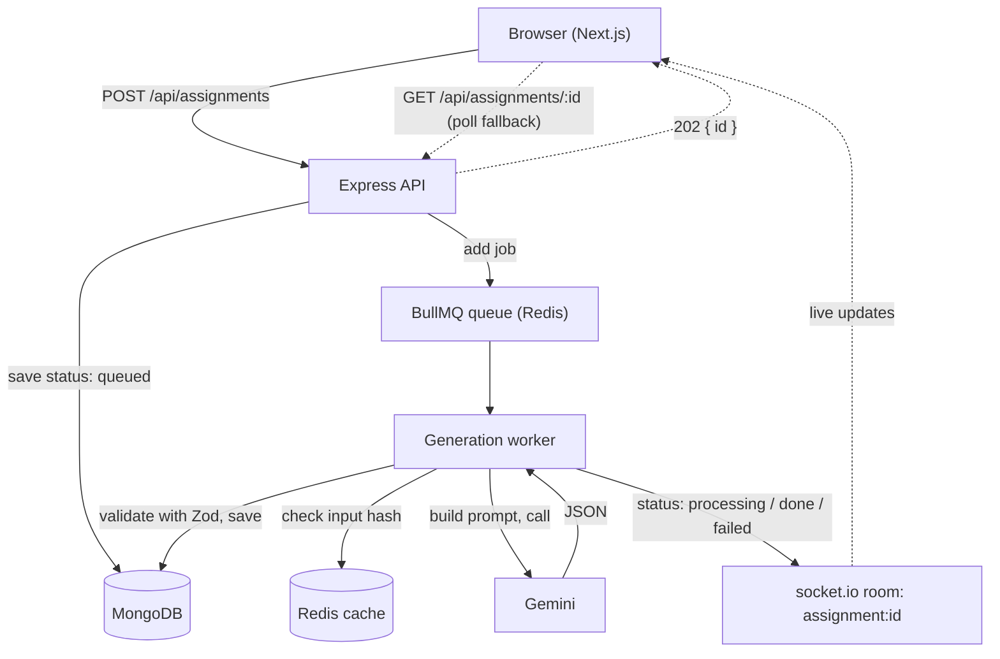

# VedaAI Assessment Creator

A tool for teachers to create an assignment, have an AI draft a full question paper from their inputs, and view or download it as a clean, exam style sheet.

Live app: https://frontend-kappa-wine-92.vercel.app
API: https://vedaai-backend-oep0.onrender.com

## What it does

1. Teacher fills a form: optional source file, due date, question types with counts and marks, and any extra instructions.
2. The request goes into a job queue. A worker turns the inputs into a structured prompt, calls Gemini, validates the result, and saves it.
3. The output page subscribes over a websocket and updates live as the job moves from queued to processing to done. The finished paper renders section by section and can be downloaded as a PDF.

## Stack

Frontend: Next.js (App Router) + TypeScript, Tailwind, Zustand for form and shared state, socket.io client for live updates, react-pdf for the PDF export.

Backend: Node + Express + TypeScript, MongoDB (Mongoose), Redis, BullMQ for the job queue, socket.io for realtime, Zod for validation.

AI: Google Gemini (`gemini-2.5-flash`).

## Architecture



The generation is async on purpose. A model call takes anywhere from a few seconds to half a minute and can fail or hit a quota, so doing it inline would block the request and give a worse experience. Putting it behind a queue keeps the API fast, lets the worker retry with backoff, and gives the UI something real to show while it waits.

The worker runs inside the same process as the API. On a single free dyno that keeps the whole thing in one service, but the worker is written as its own module so it can be split into a separate process later without changing the queue or the API.

The frontend listens on a websocket and also polls `GET /api/assignments/:id` as a fallback, so a dropped socket does not leave the page stuck.

## Approach and decisions

- The model output is never rendered directly. Every response is parsed and checked against a Zod schema (`backend/src/schemas/paper.schema.ts`) before it is stored or shown. If the JSON is malformed the worker retries once with a stricter prompt, and only then marks the job failed. This is what keeps a bad model day from breaking the page.
- Inputs are hashed (sha256 of subject, grade, instructions, material, and question types) and the generated paper is cached in Redis for 24 hours. Re-submitting the same brief returns instantly and skips the model call.
- Multiple Gemini keys are read from one env var and rotated. If a key returns a quota error the worker moves to the next one, which matters on the free tier where a single key runs out quickly.
- An uploaded file is read in the browser (text and PDF) and its text is sent along as source material so the questions are built from the teacher's own content rather than a generic guess.
- Grade strings from the model are normalized to a single format ("8th", not "Class VIII" or roman numerals) so the output stays consistent.
- PDF is generated on the client with react-pdf rather than a screenshot or `window.print`, so the output is real vector text, not a picture of the page. A server side headless browser would have been heavier than the free dyno can handle and was not worth it here.

## Project structure

```
.
├── frontend/        Next.js app
│   └── src/
│       ├── app/(dashboard)/assignments/   list, create, output pages
│       ├── components/                     layout, cards, output, ui
│       ├── store/                          Zustand stores
│       └── lib/                            api client, socket, pdf, file text
└── backend/         Express API + worker
    └── src/
        ├── routes/        assignment endpoints
        ├── services/      prompt, gemini, cache, assignment
        ├── queues/        BullMQ queue
        ├── workers/       generation worker
        ├── models/        Mongoose schema
        ├── schemas/       Zod request and paper schemas
        └── ws/            socket.io setup
```

## Running locally

You need Node 18 or newer, a MongoDB connection string (Atlas works), a Redis URL (Upstash works, or a local Redis), and at least one Gemini API key.

```bash
# from the repo root
npm install

# backend config
cp backend/.env.example backend/.env
# then fill in the values (see below)

# run the two apps in separate terminals
npm run dev:backend     # http://localhost:4000
npm run dev:frontend    # http://localhost:3000
```

The frontend defaults to `http://localhost:4000` for the API. To point it elsewhere set `NEXT_PUBLIC_API_URL`.

### Backend environment

| Variable | What it is |
|----------|-----------|
| `MONGODB_URI` | MongoDB connection string |
| `REDIS_URL` | Redis URL (use `rediss://` for TLS, e.g. Upstash) |
| `GEMINI_API_KEYS` | One or more Gemini keys, comma separated, rotated on quota |
| `GEMINI_MODEL` | Model name, defaults to `gemini-2.5-flash` |
| `CLIENT_URL` | Allowed origin for CORS and websockets |
| `PORT` | API port, defaults to 4000 |

### Frontend environment

| Variable | What it is |
|----------|-----------|
| `NEXT_PUBLIC_API_URL` | Base URL of the backend |

## Deployment

Frontend is on Vercel. Backend runs on Render as a single web service that hosts both the API and the worker. MongoDB is on Atlas and Redis is on Upstash. Both deploy from the `main` branch.

## API

| Method | Path | Purpose |
|--------|------|---------|
| `POST` | `/api/assignments` | create an assignment and queue generation, returns `{ id }` |
| `GET` | `/api/assignments` | list recent assignments |
| `GET` | `/api/assignments/:id` | fetch one with its status and result |
| `POST` | `/api/assignments/:id/regenerate` | re-run generation |
| `DELETE` | `/api/assignments/:id` | delete |
| `GET` | `/health` | health check |

## Bonus work

- PDF export with proper formatting through react-pdf, not a raw print.
- Redis caching keyed on the input hash so repeat briefs skip the model.
- Difficulty shown as colored tags on screen and in the PDF.
- Regenerate action on the output page.
- A "Load example" button on the create form that fills in a realistic brief so the flow can be tried in one click.
- Live status over websockets with a polling fallback.
